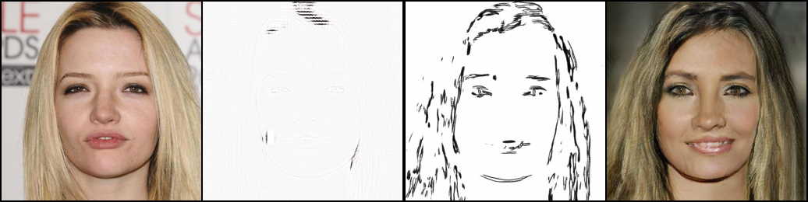
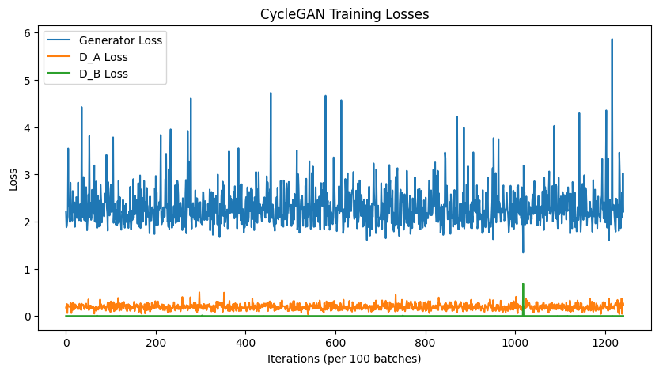

# CycleGAN: Person Face ↔ Sketch Translation

This notebook demonstrates a complete implementation of a CycleGAN model to translate between **real person face images** and their corresponding **sketches** using PyTorch. The dataset follows a folder structure with `face/` and `sketch/` directories.

## 🧠 What This Notebook Does

The notebook performs the following steps:

1. **Environment Setup**
   - Loads required libraries like PyTorch, torchvision, and PIL.
   - Configures device usage (`cuda` if available).

2. **Dataset Preparation**
   - Loads and transforms face and sketch images from the `/face` and `/sketch` directories.
   - Implements a custom `ImageDataset` class to handle both domains.
   - Dataset used: [Person Face Sketches](https://www.kaggle.com/datasets/almightyj/person-face-sketches) from Kaggle.
  
3. **Model Architecture**
   - Defines:
     - `ResnetGenerator`: For generating images using residual blocks.
     - `Discriminator`: PatchGAN-based discriminator for adversarial learning.

4. **Loss Functions & Optimizers**
   - Uses:
     - Adversarial Loss (`MSELoss`)
     - Cycle Consistency Loss (`L1Loss`)
     - Identity Loss (`L1Loss`)
   - Sets up Adam optimizers.

5. **Training CycleGAN**
   - Performs bidirectional training between Face ↔ Sketch using generators `G` and `F`.
   - Uses historical buffers for stabilized discriminator training.

6. **Image Saving & Visualization**
   - Periodically saves generated images to compare original and translated results.

## 🔍 Sample Output

Below is a screenshot showing a translated image output from the model (face → sketch and sketch → face):



## Loss curves 




## 📁 Dataset Structure

person-face-sketches/
├── face/ # Real face images
└── sketch/ # Corresponding sketch images

markdown
Copy
Edit

## 🚀 How to Run

1. Clone this repository or download the notebook.
2. Place the dataset in the appropriate folder structure.
3. Run all cells in the notebook sequentially.

> Note: Ensure you have access to a GPU for faster training.

## 🛠 Requirements

- Python 3.8+
- PyTorch
- Torchvision
- NumPy
- Matplotlib
- PIL

Install dependencies using:

```bash
pip install torch torchvision numpy matplotlib pillow
📌 Notes
The model uses ResNet blocks and PatchGAN discriminators to perform the transformation.

Loss weights (lambda_cycle, lambda_identity) can be tuned for better output quality.
```
## 📌 Notes
The model uses ResNet blocks and PatchGAN discriminators to perform the transformation.

Loss weights (lambda_cycle, lambda_identity) can be tuned for better output quality.

